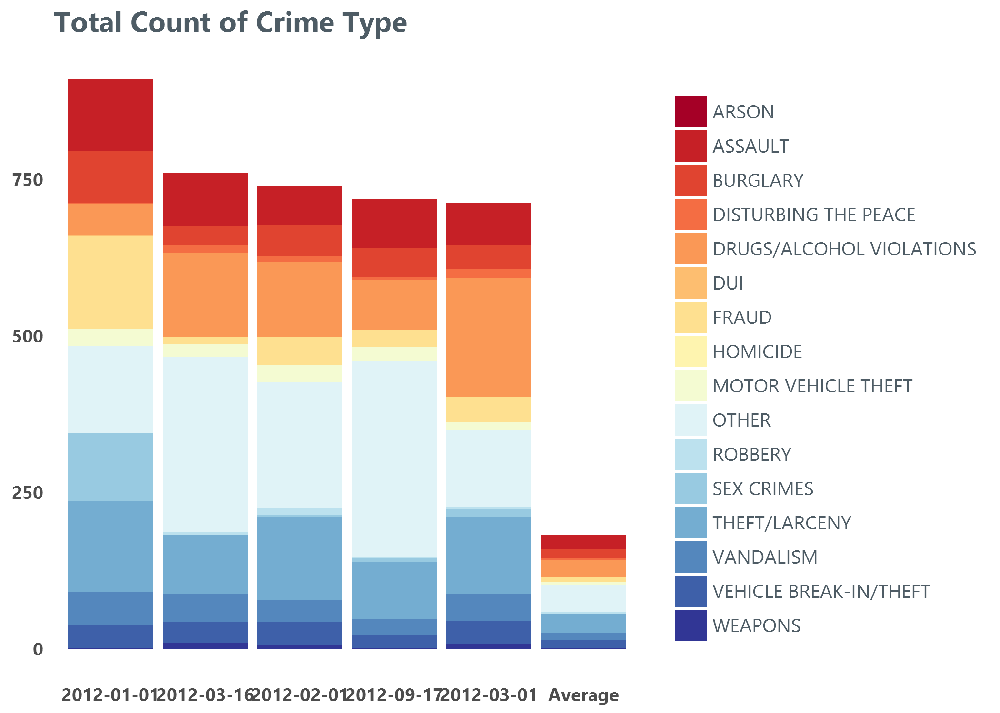
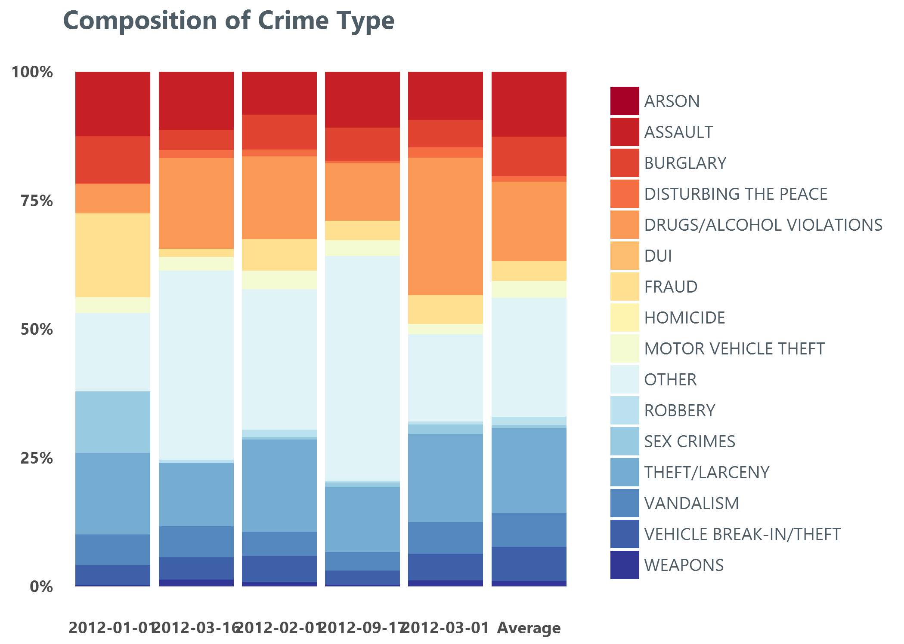
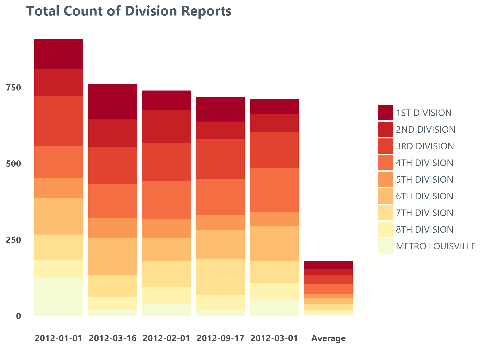
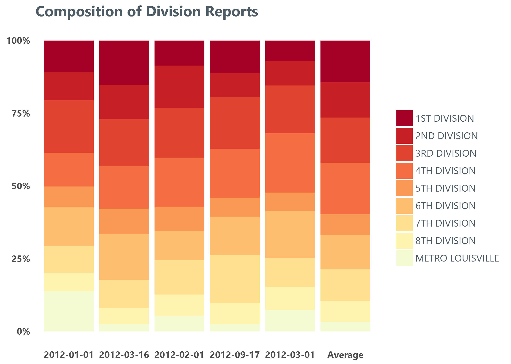

# Analyzing Louisville Crime Trends

## The Data

After a lengthy break, Quantify Louisville is back! For our first
post of 2017 we decided to look into the last ten years of Louisville
crime reports [2007 -
2016](https://data.louisvilleky.gov/dataset/crime-data). In addition, we
have also begun publishing our R code so that anyone interested can
reproduce our analysis and visuals.

After a fairly minor bit of data manipulation, our first visualization
shows the total reported crimes by the month in which they occured. A
few things stand out that appear to be issues with the data. Many crime
types appear to fall to and remain at zero for most of 2009. This could
potentially represent missing data. Conversely, 2012 appears to have
been a major crime wave with nearly all crime type showing monthly
totals well above the rest of the data set. It is possible reports in
2012 were collected differently than in other years, or a system issue
is creating false spikes.

Assuming that the first-glance data issues described above don't
completely remove the data's usefulness, it appears that the rise in
weapons has some relationship to the rise in homicides. The graph below
shows the number of homicides per month along the x-axis, while the
y-axis shows the number of weapons occurences which were reported.

Based upon only these data series, it appears that an increase in the
number of weapons crimes reported corresponds to a similary-time
increase in the number of homicides that occur.

Based upon the graph above, it looks like the weapons occurence reports
for the 2nd Division (a division which includes the neighborhoods
Algonquin, California, Chickasaw, Hallmark, Park Duvalle, Park Hill,
Parkland and Shawnee) appear to have the strongest relationship to the
number of homicide reports. A convenient way to interpret the simple
correlation is to assume that more weapons-related reports imply an
increase in the number of weapons present in those neighborhoods, which
leads to a high number of homicides.

We can visualize this more by mapping the divisions and shading each
based on how strong the relationship is between weapons charges and
homicide. It's even more clear looking at it this way that the Second
Division has a much higher relationship between the two than the others.

Looking at it this way, we can easily see that the largest relationship
(although, not huge by any means) falls in the Second Division - and is
significantly different than most other divisions with the exception of
the Fourth Division, which is right next to the Second.

This is in no way a claim that there is a causal relationship between
the two. However, it is definitely interesting that in certain
divisions, there definitely tends to be some correlation between weapons
charges and homicides. Intuitively, this definitely makes sense - if
there tends to be higher homicide levels then it stands to reason that
there would exist more weapons in circulation (or, vice versa). However,
a case could be made that there is a leading indicator somewhere in the
rise of homicides if we see a rise in weapons charges.

Despite this, it is important to note other possible interpretations.
For example, it is possible that specific weapons and homicide reports
represent the same incident. If that were to be the case, then the
visual is simply catching this double counting. A cursory review of the
dates and address of homicides and weapons occurence reports seem to
show that the double counting is not present. However, given the
looseness of some of the date-related data (described below), it is not
100% conclusive.

Lastly, it is not clear whether all records in the data set are created
through citizens making reports, or if policing has some influence as
well. Were the second option to be the case, distinctions made between
divisions would become muddier.

What will also be interesting as we dig further into this data is
whether that type of relationship exists for other types of crimes. This
isn't groundbreaking in any way - and underpins the 'Broken Windows'
policing philosophy where smaller proprety crimes tend to predict more
violent crimes.

## Hilarious Date Outliers

It is important to note, that almost all data analysis comes with
potential data issues that can create obtacles or completely derail the
goals. This data set is no exception. While we won't detail each bit of
our data review, we will try to highlight a few tricks we tend to resort
to. For example, one easy way that tends to yield silly results is to
create comparisons between dates in the set and intepret the outliers
literally. In this particular data set, both the date a crime occured
and the time it was reported are captured.

Some crimes appear to be reported days, weeks, and sometimes even
*years* after they occurred. The visual below tallies any crime from ten
years that was reported at least one year after it allegedly
perpetrated.

Understandably, sexual assults and identity thefts make up a large
portion of the crimes with a long lag between their occurence and
report. However, according to this data set someone also waited over 12
years to report a stolen firearm and a burglary on 24th Street wasn't
reported for over a decade ("Should I call the cops? Does that *really*
qualify as a burglary? Maybe I should sleep on it for one more night and
see how I feel in the morning.").

Perhaps the most baffling the records include the 32 times in the last
ten years in which someone waiting over a year to report that someone
was Disturbing The Peace. While the majority of those appear to be
prostitution related, one record seems to indicate that someone waited
SEVEN YEARS to report that someone got a little crazy in a 7th street
bar.

At the other extreme, some crimes appear to have been reported before
they even occurred. These Minority-Report crimes, one would think,
should be fairly easy to prevent.

The extremes at both ends of the occured and reported dates make it
difficult to the dates relative to each other to answer questions other
than in the most broad sense. To cut through that a bit, let's take a
look at the five most active days from the sense of crime. We can then
compare those totals to a day that would be made up of the average total
crime numbers for each crime type - we're calling this the "Average
Day", although we fully realize that looking at the average of 16
different types of crime doesn't *fully* reflect an average day of total
crime.

The most obvious bit of insight here is how much larger our bars are in
the top five as compared to the average. The top five days have activity
levels near 700 charges a day - whereas our average is sitting around
200 for the day. This nearly 4-fold increase above the average is
certainly significant in magnitude, but are these days truly significant
in the makeup of the crime? In other words, are they driven
significantly higher because of the presence of a single type of crime -
or is the composition largely the same, with just more activity across
the board?

To help answer that, we can break down the composition of the type of
crime across the top five most active days and the average. And when we
do that, a couple of interesting points pop out For one - there are a
couple of call outs. Sex crimes were up significantly above the average
on Jan 2nd, 2012 according to the data. Also, there were a whole lot more
charges for disturbing the peace on March 17th of the same year, and a
slew of crimes labeled simply as 'other' on September 17th.

What's most interesting, perhaps, is that there isn't anything
particularly special about the top five days as compared to the average.
The composition of crime on those days is largely consistent with the
average - which means that there was no single reason why these dates
stood out from the rest. The makeup of crime on those days was
essentially the same - there was just more of each.

The next question to ask is: Is this composition holding true on these
days across the entire region? Or are we seeing one division
disproportionately affected by increased activity in one type of crime
that it typically never witnesses, and therefore driving the overall
totals higher?

Within different divisions, Metro Louisville reports made a much larger
proportion of the crime reports on 1-1-2012 than would be typical, or as
occured on other high-volume days. Interestingly, the 4th division
(neighborhoods Beechmont, Cloverleaf, Fairgrounds, Germantown,
Hazelwood, Iroquois, Jacobs, Limerick, Merriwether, Old Louisville,
Paristown, Schnitzelburg, Shelby Park, Smoketown Jackson, South
Louisville, Taylor Berry, University, Wilder Park and Wyandotte) tends
to contribute the most reports on a typical day.

So, what can we make of these high-volume days? As with other sections
of this data, it is possible that how the data is collected makes it
difficult to find meaing from the daily aggregations. In real life, do
the most heavy crime days *really* feature four times as many crimes as
the average day? If not, the data set is not really capturing what it is
intended to capture.

For our crime data post, we intend to pull a larger section of
demographic data in order to attempt to further explain the recent
increase in both reports of weapons-related crime and homicdies.

As always, please don't hesitate to contact us with comments and
questions.

[**Michael Weis**](mailto:michaelweis@gmail.com)
 
[**Eric Bickel**](mailto:bickel.eric@gmail.com)
