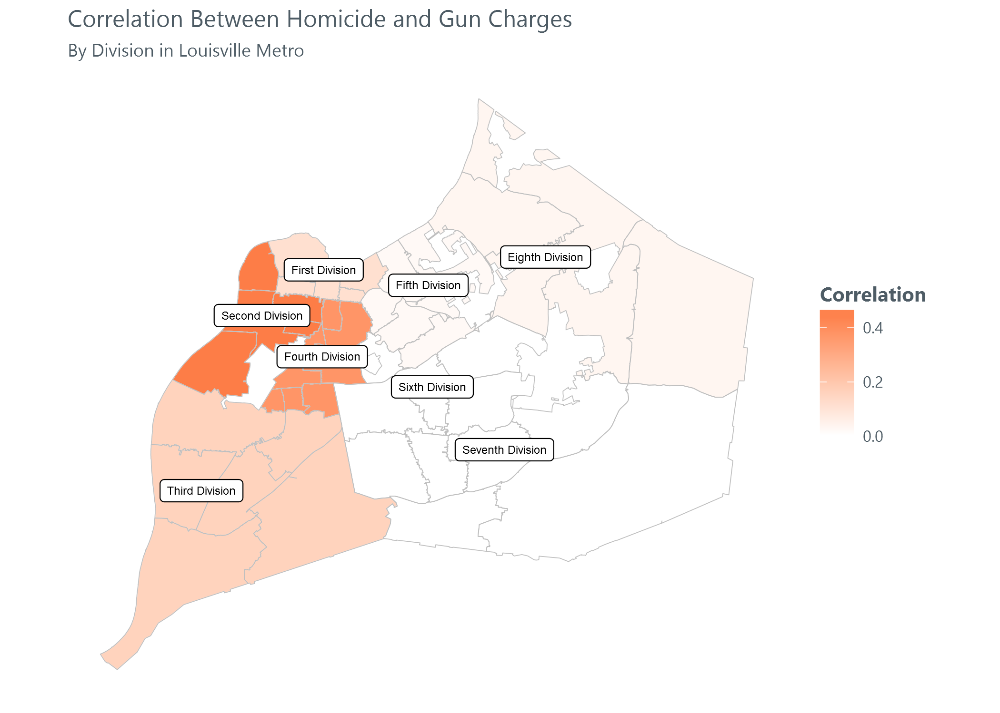

## Criminal Analysis

## The Data
For our initial exploration of this data set, we tackled crimes reports
from the last ten years [2007 -
2016](https://data.louisvilleky.gov/dataset/crime-data).

## Things To Do Today
-   Get the data in...
-   Do things to it...
-   Look at it...
-   Say things about it...
-   <s>Commit a few crimes and track how long it takes to impact the
    data</s>

## Hilarious Outliers

It is important to note, that almost all data analysis comes with
potential data issues that can create obtacles or completely derail the
goals. While we won't detail each bit of our data review, we will try to
highlight a few tricks we tend to resort to. For example, one easy way
that tends to yield silly results is to create comparisons between dates
in the set and intepret the outliers literally. In this particular data
set, both the date a crime occured and the time it was reported are
captured.

Some crimes appear to be reported days, weeks, and sometimes even
*years* after they occurred. The visual below tallies any crime from ten
years that was reported at least one year after it allegedly
perpetrated.

Understandably, sexual assults and identity thefts make up a large
portion of the crimes with a long lag between their occurence and
report. However, according to this data set someone also waited over 12
years to report a stolen firearm and a burglary on 24th Street wasn't
reported for over a decade ("Should I call the cops? Does that *really*
qualify as a burglary? Maybe I should sleep on it for one more night and
see how I feel in the morning.").

Perhaps the most baffling the records include the 32 times in the last
ten years in which someone waiting over a year to report that someone
was Disturbing The Peace. While the majority of those appear to be
prostitution related, one record seems to indicate that someone waited
SEVEN YEARS to report that someone got a little crazy in a 7th street
bar.

At the other extreme, some crimes appear to have been reported before
they even occurred. These Minority-Report crimes, one would think,
should be fairly easy to prevent.

The extremes at both ends of the occured and reported dates make it
difficult to the dates relative to each other to answer questions other
than in the most broad sense.

When viewing the number of reported crimes occuring per month, there is
a noticable uptick in homicides and weapons complaints per month over
the past year or so.

Particularly, it appears that the rise in weapons has some relationship
to the rise in homicides. The graph below shows the number of homicides
per day along the x-axis, while the y-axis shows the number of weapons
occurences which were reported.

There is a fairly strong correlation between a Weapons-related crime
being reported, and a Homicide being reported.

For the most part, it looks like the weapons occurence reports for the
2nd Division (a division which includes the neighborhoods Algonquin,
California, Chickasaw, Hallmark, Park Duvalle, Park Hill, Parkland and
Shawnee) appear to have the strongest relationship to the number of
homicide reports. A convenient way to interpret the simple correlation
is to assume that more weapons-related reports imply an increase in the
number of weapons present in those neighborhoods, which leads to a high
number of homicides.

However, there are other possible interpretations. For example, it is
possible that specific weapons and homicide reports represent the same
incident. If that were to be the case, then the visual is simply
catching the double counting. A cursory review of the dates and address
of homicides and weapons occurence reports seem to show that the double
counting is not present. However, given the looseness of some of the
date-related data, it is not 100% conslusive.

We can visualize this more by mapping the divisions and shading each
based on how strong the relationship is between weapons charges and
homicide. It's even more clear looking at it this way that the Second
Division has a much higher relationship between the two than the others.

Looking at it this way, we can easily see that the largest relationship
(although, not huge by any means) falls in the Second Division - and is
significantly different than most other divisions with the exception of
the Fourth Division, which is right next to the Second.

This is in no way a claim that there is a causal relationship between
the two. However, it is definitely interesting that in certain
divisions, there definitely tends to be some correlation between weapons
charges and homicides. Intuitively, this definitely makes sense - if
there tends to be higher homicide levels then it stands to reason that
there would exist more weapons in circulation (or, vice versa). However,
a case could be made that there is a leading indicator somewhere in the
rise of homicides if we see a rise in weapons charges.

What will also be interesting as we dig further into this data is
whether that type of relationship exists for other types of crimes. This
isn't groundbreaking in any way - and underpins the 'Broken Windows'
policing philosophy where smaller proprety crimes tend to predict more
violent crimes.

